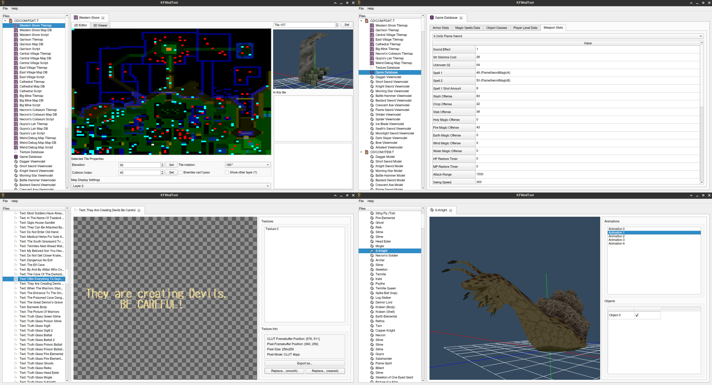

# FSModTool
From Software game modding/datamining tool. Breaks often, so be careful!

This is the fruit of the community's efforts in understanding how the game works and is here in the hopes that it might provide help to those who are interested in modding or digging into the game.

If you need help with FSModTool or would like to discuss early From Software game internals and reverse engineering, join [The FromSoft Modding Committee Discord Server](https://discord.gg/jUzZwWWUXd)!

For King's Field IV Tools and Documentation, check out [TheStolenBattenberg's ToolsForKFIV](https://github.com/TheStolenBattenberg/ToolsForKFIV)!

# Technical info

FSModTool is written using C++17 and the Qt Framework.

Automated builds for 64-bit Linux (cross-distribution AppImages based on Ubuntu 16.04) and Windows are available on the project's [Releases page](https://github.com/FromSoft-Modding-Committee-FSMC/FSModTool/releases).

# Features

* (KF2) Basic map editing with 3D preview, including editing entities and objects.
* Game Database editing, enabling you to modify armor stats, object classes, spell attributes, player level data, and weapon stats.
* (KF2 US ver.) Game Executable editing, allowing you to edit strings and shop info. 
* Texture viewing, exporting and replacement
* 3D model viewing (no support for animated KF1J models yet!)

FSModTool currently supports loading files from the following games:

* Armored Core [SCUS-94182, SLUS-01323]
* Armored Core (Japan) Demo from Dengeki PlayStation D2 [SLPM-80109]
* Armored Core (Japan) Demo from Hyper PS Remix Vol. 7 [SLPM-80113]
* Armored Core (USA) Demo from Interactive CD Sampler Volume 4 [SCUS-94418]
* Armored Core (USA) Demo from PlayStation Underground Number 3 [SCUS-94191] and OPM Demo Disc 2 [SCUS-94198]
* Armored Core (Japan) Demo from Tech PS 97-7 [SLPM-80108]
* Armored Core "Preview Only 7-3-97" Prototype
* King's Field I [SLPS 00017, SLPS 03578]
* King's Field I Demo from DemoDemo PlayStation Soukan-gou Vol. 1 [PCPX 96003]
* King's Field II [NPJJ-00083, SCES-00510, SLPS-00069, SLPS-03579, SLPS-91003, SLPS-91423, SLUS-00158]
* King's Field III [SLPS-00377, SLPS-03580, SLPS-91089, SLUS-00255]
* King's Field III: Pilot Style [SLPM-80029]
    * FSModTool also supports loading the King's Field 3 demo present in the Pre-Pre Vol. 3 disc [PCPX-96028]. It has the same content as Pilot Style, but has limited time.
* Shadow Tower [SLPS-01420, SLUS-00863]
* Shadow Tower Demo from PlayStation Underground v2.4 [SCUS-94298]

**BEWARE:** The main focus is still KF2. King's Field 3 maps will load but will have incorrect entity/sound/weapon names and missing objects since we haven't documented KF3 yet and the KF2 names are loaded instead. Support for all games except KF2 is only for loading model and texture files.

# Credit where it's due
This project could not have been written without TheStolenBattenberg's [Psycpros](https://github.com/TheStolenBattenberg/Psycpros) project.

Monster Mesh IDs were mostly found in [Shrine Maiden's King's Field II code page](http://mikosans.web.fc2.com/code/kings-field-2.html).

A lot of the work discovering fields of the map file structures was done by Mendzen.

FSModTool uses the [libimagequant](https://pngquant.org/lib/) library, which is licensed under the [GPLv3 with additional copyright notices](https://raw.githubusercontent.com/ImageOptim/libimagequant/master/COPYRIGHT).
